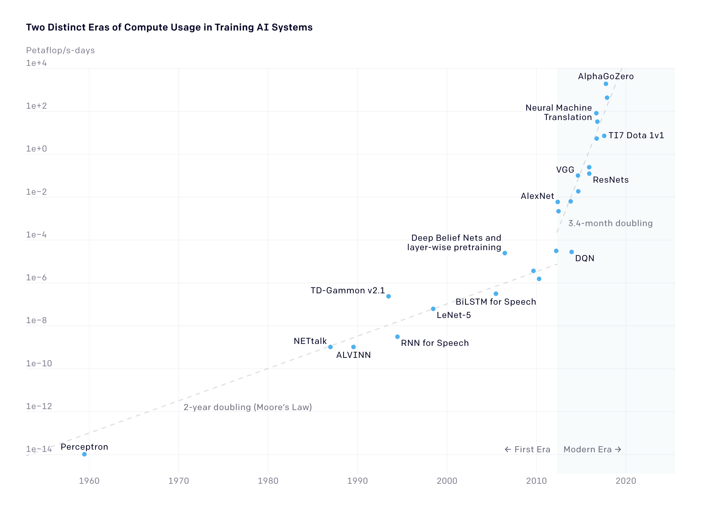
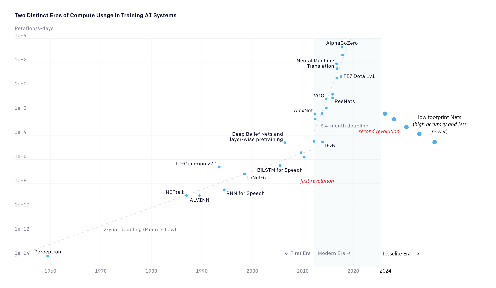

# **The Second Artificial Intelligence Revolution::** *Low Footprint And High Accuracy Models*

## **The first Artificial Intelligence revolution**

*first revolution of AI models is captured by the inflexion of compute operations amount (10^15 FLOPS)[^1].*

Around 2010s, there was a surge in the compute usage of AI models with the introduction of AlexNet. The new trand is about 5 times higher than the previous trend. 
According, to openAI the compute operation are doubling every 4 months.  
the inflexion can be captured with other norms like the number of models' parameters.[^5] 

[^1]: source: https://openai.com/research/ai-and-compute

Let's do some simple maths:

The latest model AphaGoZero requires 2000 PetaFlops of compute capacity.

The latest hardware has the following performance per dollar and watt:

  - 1 TeraFlops uses 6W[^2]
  - 1 TeraFlops costs 20$[^2]

By a cross rule, we deduct:

  - 2000 PetaFlops use 12 MegaW
  - 2000 PetaFlops cost 40 million of $

To put in perspective, computational demand of a single-purpose model:

  - consumes as much power as 1,000 fully equipped homes 24/7 on raw computational power only, not speaking of cooling and electric systems. The proper figures would likely be 3,000-10,000 homes.
  - costs as much as 1-3 large datacenters.[^4]

It is not exaggerated to say that AI is very expensive. Very expensive. That technology is not for small business and normal consumer. AI first revolution concern big companies with huge R&D budget or startups with huge funds. 
Only those companies might make AI profitable. It is not clear at this point in time, that any company has make AI profitable compare to the large investment required. On the business side, it is not obvious how AI first revolution is a breakthrough.  

Nonetheless, on the scientific side, AI first revolution is a breakthrough. It is obvious according to amount of publication on the topic. It is obvious on the side of data greedy scientific fields like molecular sciences. But not obvious for other sciences like linguistic which are still sketical about the magic behind those AI technologies.
Therefore, the breakthrough is still propagating and reshuffling sciences fields.

At Tesselite, we think that the scientific breakthrough is:
- not that data greedy AI machine learning science is winning.
- not that other sciences must incorporate more AI science.

At Tesselite, we think that the scientific breakthrough is theoretical and profound. Let's take example of computer vision models. A visual object can be computed into word, like a mere algorithm. Doesn't it reflect the profound nature of object recognition? of geometry?

Doesn't indicate there is a computational space where lives the geometry? Where the geometry can be instantly recognized? Where the geometry has a obvious meaning? a trivial shape? a trivial relief?

[^2]: source: https://en.wikipedia.org/wiki/FLOPS
[^3]: source: https://www.eia.gov/energyexplained/use-of-energy/electricity-use-in-homes.php
[^4]: source: https://www.streamdatacenters.com/glossary/data-center-cost/
[^5]: we investigated different norms to better understand the behavior of relief algorithm: FLOPS like norms are the most stable norms for predicting behavior of compute intensive algorithms on different hardware.

## **The second Artificial Intelligence revolution**

The second AI revolution, building upon the lessons learned from its predecessor, focuses on crafting compact, highly accurate models with minimal energy requirements. The breakthrough lies not merely in scaling down the existing models but in a fundamental rethinking of AI architectures. Researchers and developers have dissected the inner workings of the massive models from the first wave, distilling their essence to create streamlined, efficient versions.

These compact AI models represent a scientific digest of the first revolution's achievements and shortcomings. By harnessing advanced algorithms, novel architectures, and data-efficient techniques, these models achieve remarkable accuracy while drastically reducing the computational burden. They can be embedded into small chips, enabling deployment in edge devices and IoT technologies without straining power resources.

The significance of this shift cannot be overstated. These low-footprint, high-accuracy AI models hold the promise of powering a new wave of innovations across industries. From enabling real-time language translation on handheld devices to facilitating autonomous operations in energy-constrained environments, these models pave the way for practical, energy-efficient AI applications that were previously unattainable.

This second revolution not only represents technological advancement but also a step towards sustainability. By significantly reducing energy consumption without compromising on performance, these models align with the growing imperative to develop AI that is not only powerful but also environmentally conscious.

In conclusion, the journey from massive, resource-intensive AI models to compact, energy-efficient ones symbolizes the evolution of AI towards practicality, efficiency, and sustainability. The second wave of AI revolution heralds a new era where AI's potential can be harnessed responsibly, opening doors to a multitude of applications that were once only a distant dream.
